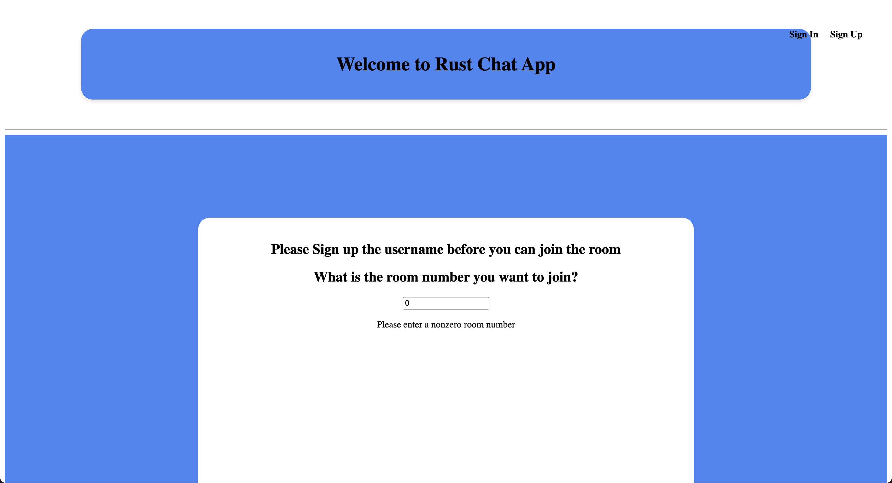
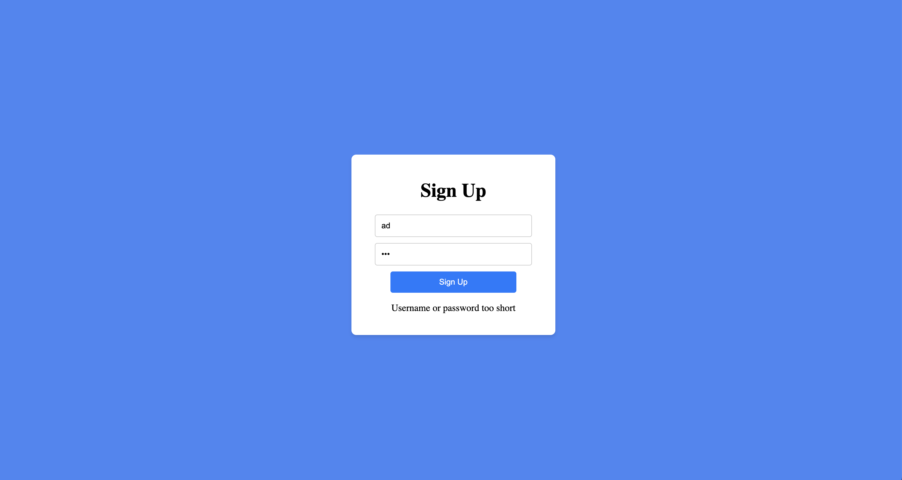
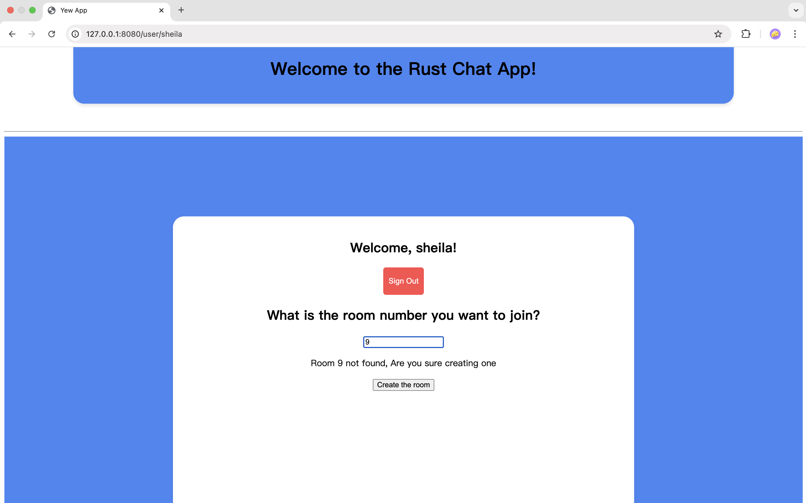
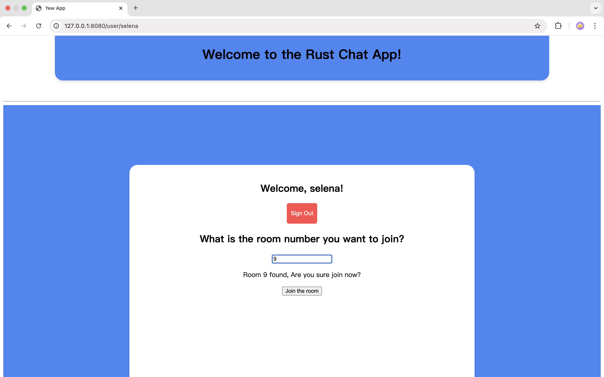
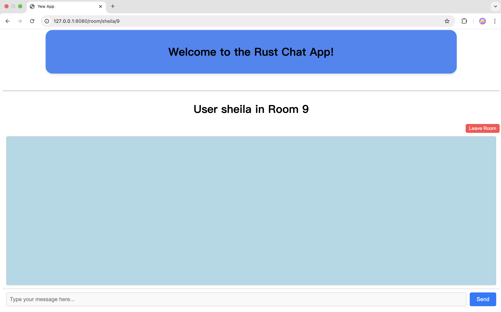

# ECE1724 Course Project (Real-Time Chat Application) - Final Report

| Student Name        | Student ID | Student Email                 |
|---------------------|------------|-------------------------------|
| Zhaoyu (Selena) Yan | 1006521621 | zhaoyu.yan@mail.utoronto.ca   |
| Yiran (Sheila) Chen | 1004392739 | sheila.chen@mail.utoronto.ca  |
| Yixu (Henry) Ye     | 1010506579 | yixu.ye@mail.utoronto.ca      |

## Motivation

Real-time communication is central to our digital lives, shaping everything from work meetings to casual catch-ups with friends. While many established chat applications exist, they often face performance and scalability challenges under high user loads. Several of these platforms may struggle to provide low-latency communication and a robust infrastructure for thousands of concurrent users.

Motivated by these common issues, our team has decided to address them in our project by leveraging the unique strengths of Rust. While domains like web and network application development are typically dominated by languages like JavaScript and Python—each with mature ecosystems and extensive tooling—Rust offers standout features that make it an ideal candidate for building real-time systems such as chat applications.

The potential advantages of Rust include its memory safety guarantees, concurrency model, and performance, which are crucial for building scalable and efficient real-time communication systems. Rust’s memory safety without garbage collection ensures that we can achieve predictable performance without the overhead of runtime memory management, which is crucial for latency-sensitive applications. Its ownership and borrowing model allows for safe concurrency, preventing common multithreading errors like data races. Rust’s message-passing capabilities and asynchronous programming model allow us to efficiently handle large numbers of simultaneous connections, making it a great fit for network-heavy applications. Besides, its strong type system helps us catch bugs at compile time, significantly reducing runtime errors, which enhances both reliability and maintainability. We are driven by the potential to enhance user experience through these unique advantages, ensuring that our application can handle high traffic without compromising performance.

Although Rust has been gaining popularity, it is still less commonly used for building mainstream chat applications, leaving a gap in the market for a Rust-native solution. We aim to fill this gap by developing a real-time chat application written entirely in Rust for our course project. This project will not only enable us to solve real-world problems but also showcase Rust's potential in creating high-level, user-facing applications beyond its typical system programming uses.

## Objectives

The main objective of this project is to design and implement a high-performance real-time chat application using Rust, providing features such as user registration, login, chat room creation and participation, and instant message exchange. This project also intends to showcase Rust's capabilities in building a reliable and efficient communication system, with a strong focus on optimizing backend performance while maintaining a user-friendly frontend.

Considering that most Rust-based chat applications currently depend on frontend frameworks like React, with limited exploration of Rust-native frameworks for frontend development, this project aims to bridge that gap. By leveraging the Yew framework to build the chat application's user interface, the project seeks to enrich the Rust ecosystem.

The backend will use Actix Web, a powerful and scalable framework for high-performance web development. By integrating Actix Web with WebSocket, the application could efficiently handle multiple concurrent client connections, ensuring low-latency, real-time communication even under heavy user loads. This combination guarantees the application remains responsive and reliable, providing a seamless messaging experience. Additionally, the backend will leverage SurrealDB, a modern database solution, for message persistence and history retrieval.

Ultimately, the project aims to create a fully functional chat application written entirely in Rust, showcasing the language's potential for building more than just system-level software. By connecting a high-performance backend with a responsive, user-friendly frontend, this project explores how Rust can be used to create innovative web applications and contribute to its growing adoption in the industry.

## Key Features

Our real-time chat application incorporates several essential features designed to ensure a seamless and engaging user experience. Each feature supports the objective of building a scalable and efficient communication platform. Below are the main features:

#### 1. User Registration
Users can register by providing a username and password. To ensure security, the username must be at least three characters long, and the password at least five characters. The system validates the input and provides feedback if the criteria are not met (e.g., "username or password too short"). The username must also be unique, verified against existing records in the database. If the username already exists, the user is prompted to choose another one. Successful registration securely stores the username and a hashed password in the database to protect against unauthorized access.

#### 2. User Login and Authentication
Users can log in with their registered credentials. If the username is unregistered, the system notifies the user to sign up first. If the username exists but the password is incorrect, the user is prompted with "Invalid password." Upon successful login, the system generates a JWT token valid for 12 hours, allowing access to protected features such as chat rooms without re-entering credentials. Once the token expires, users are required to re-login to maintain security.

#### 3. User Session Management
Logged-in users can log out at any time, which invalidates their session. They cannot access chat rooms or send messages without re-logging in. This mechanism ensures that only authenticated users can interact with the system, enhancing security and scalability.

#### 4. Chat room creation and joining
Users can create new chat rooms with unique room numbers, allowing others to join and engage in conversations. Each chat room operates independently, ensuring that messages sent within a specific room are visible only to its participants. This isolation enhances privacy and minimizes distractions, enabling users to focus on their discussions. By providing dedicated spaces for communication, this feature empowers users to engage in their favorite topics with ease and efficiency.

#### 5. Real-time messaging using WebSockets
The application utilizes WebSocket technology, a protocol designed to establish a persistent, full-duplex connection between clients and the server. Unlike traditional HTTP, WebSocket supports continuous, two-way communication without the overhead of repeatedly opening and closing connections. This enables the application to transmit messages instantly, ensuring a smooth and interactive user experience. By facilitating immediate message delivery, the system offers a dynamic and responsive platform for efficient and real-time communication.

#### 6. User Status Detection
The application tracks user presence in real-time, displaying statuses such as online, offline, and leave to other participants in a chat room. Logged-in users are marked as online, while logged-out users are marked as offline. When a user leaves a chat room, their status is updated to leave, allowing others to see that the user has exited the room. This feature enhances the interactive experience by fostering awareness of user activity within chat rooms.

#### 7. Message persistence and history retrieval
To ensure a reliable communication experience, all chat room messages are stored in a database, enabling both persistence and easy access to message history. This feature prevents message loss caused by unexpected disconnections or browser refreshes. Upon re-entering a chat room, users can retrieve previously exchanged messages, seamlessly resuming their conversations without missing any context. With the help of SurrealDB, the message retrieval process is fast and reliable, enhancing the user experience by providing consistent and efficient access to message history.

#### 8. User-Friendly Frontend Interface
The application includes an intuitive and responsive user interface designed with a simple and minimal aesthetic. It features clear and obvious buttons, easy navigation, and clear instructions, ensuring a seamless experience for all users, regardless of technical expertise. The interface allows users to effortlessly register, log in, create or join chat rooms, and exchange messages. Within chat rooms, real-time user status updates are prominently displayed, making interactions more engaging and transparent.

## User’s Guide

This User's Guide provides detailed instructions on how users can navigate and utilize the chat application’s features, such as signing up, logging in, joining chat rooms, sending messages, and more.

### Public homepage
Once the frontend is running, the app's public homepage will be displayed in your browser.

- At the top of the page, you'll see a welcome message: _"Welcome to the Rust Chat App!"_
- In the center of the page, a message reads: _"Please Sign up the username before you can join the room."_
- In the top-right corner, you will find the **Sign In** and **Sign Up** buttons.

### Sign-Up
Click on the **Sign Up** button to navigate to the sign-up page.
- On this page, you can enter a username and password.
- After entering your credentials, click the **Sign Up** button below the input fields.

- The username must be at least 3 characters long and the password must be at least 5 characters long.
- If the username or password is too short, an error message will appear: _"Username or password too short."_

- If the username is already taken, the system will notify you with: _"Username already exists."_  
- In both cases, you can adjust your input and try again.

Upon successful registration, a message will be displayed: _"Sign-up successful!"_  
Click the **Go to Sign-In** button to proceed to the sign-in page.

### Sign-In
Registered users can log in using their credentials.
- On the **Sign-In** page, enter your username and password and click the **Sign In** button.

- If the username entered is not registered, the system will display: _"User does not exist."_  
- A **Go to Sign-Up** button will appear, allowing you to navigate to the sign-up page.

- If the password is incorrect, the error message will read: _"Invalid password."_  
- You can re-enter your credentials and try again.

Upon successful login, you will be redirected to the homepage.

### Sign-Out
Once logged in, users can log out by clicking the red **Sign Out** button on the homepage.
- After logging out, you will be redirected to the sign-in page.
- Access to chat rooms and other features will be restricted until you log in again.

---

### Chat Room Creation
After logging into the system, you will be redirected to the homepage, where you can create a new chat room by entering a room number and clicking the "Create the room" button.
- If a room number already exists, you can choose to directly join the existing room.
- The default value in the room number input field is set to 0, and the default message displayed is: _"Room 0 not found. Are you sure you want to create one?"_
- Note: Since 0 is the default value, there may be cases where Room 0 already exists, but the system initially shows that Room 0 does not exist upon entering the homepage. In such situations, if you want to create Room 0 or confirm whether Room 0 already exists, please clear the input field and re-enter the room number to proceed.

### Chat Room Joining
If the room number you enter already exists, you will have the option to join the existing room directly without creating a new one. Simply click the "Join the room" button to proceed.

### Chat Room Page
After clicking the "Create the room" or "Join the room" button, you will be redirected to the "Chat Room" page. For example, if you create and enter Room 1, you will see "User xxx (your name) in Room 1" displayed at the top of the chat box on the page.

### Messaging and Real-Time Interaction
You can now start sending messages and chatting with others in the same room! To send a message, simply type it in the message box and click the "Send" button.
- For each message, you will see the username of the sender, their status, and the time the message was sent.
  

- If another user enters the same room and sends a message, you will see his/her message in real-time, as shown in the image.

## Developer's Guide
This Developer's Guide provides detailed backend API instructions on how developers can set up the chat application. For each API endpoint, this guide provides the following information:

### User Management

---
`/user/{token}`

- Method: GET
- Description: Retrieves user details based on the token.
- Parameters: token (Path): User’s authentication token.
- Example in Postman:
  assume: `token = "12345678"`
  run: `http://127.0.0.1:5000//user/12345678`
- Response:
  - 200 OK: Returns the user details.
  - 401 Unauthorized: If the token is invalid.
  
---
`/users`

- Method: GET
- Description: Retrieves all users from the database.
- Example in Postman: `http://127.0.0.1:5000/users`
- Response:
  - 200 OK: Returns a list of all users.
  - 404 Not Found: If no users are found.

---

`/new_user`

- Method: POST
- Description: Creates a new user with the specified username and password.
- Example in Postman: 
  assume: `username =  "harry" password = "12345678"`
  run : `http://127.0.0.1:5000/new_user`
- Request Body:
  `{"username": "harry",
    "password": "12345678"}`
- Response:
  - 201 Created: Returns the created user details.
  - 400 Bad Request: If validation fails.

--- 

`/update_user/{uuid}`

- Method: POST
- Description: Updates a user based on their unique identifier.
- Example in Postman:
  assume: `uuid = "12345678"`
  run : `http://127.0.0.1:5000/update_user/12345678`
- Parameters: uuid (Path): Unique identifier of the user.
- Response:
  - 200 OK: Returns the updated user details.
  - 404 Not Found: If the user does not exist.

---

### User Authentication

---

`/login`

- Method: POST
- Description: Logs in a user and generates a token.
- Example in Postman:
  assume: `username =  "harry" password = "12345678"`
  run : `http://127.0.0.1:5000/login`
- Request Body:
  `{"username": "harry",
    "password": "12345678"}`
- Response:
  - 200 OK: Returns a JWT token.
  - 401 Unauthorized: If credentials are invalid.
  
---

`/logout/{username}`

- Method: POST
- Description: Logs out the user and sets their status to offline.
- Example in Postman:
  assume: `username =  "harry"`
  run : `http://127.0.0.1:5000/logout/harry`
- Parameters: username (Path): The username of the user.
- Response:
  - 200 OK: Returns a confirmation message.
  - 400 Bad Request: If an error occurs.

---

`/get_status/{username}`

- Method: GET
- Description: retrieves the online/offline status of a user.
- Example in Postman: 
  assume: `username =  "harry"`
  run : `http://127.0.0.1:5000/get_status/harry`
- Parameters: username (Path): The username of the user.
- Response:
  - 200 OK: Returns the user’s status.
  - 404 Not Found: If the user does not exist.

---

### Chat Room Management

---

`/create_room`

- Method: POST
- Description: Creates a new chat room.
- Example in Postman:
  assume: `room_id =  "1"`
  run : `http://127.0.0.1:5000/create_room`
- Request Body:
  `{"room_id": "1"}`
- Response:
  - 201 Created: Returns the created room details.
  - 400 Bad Request: If room creation fails.

---

`/rooms`

- Method: GET
- Description: Retrieves all chat rooms.
- Example in Postman: `http://127.0.0.1:5000/rooms`
- Response:
  - 200 OK: Returns a list of rooms.
  - 404 Not Found: If no rooms are found.

---

`/room/{room_id}`

- Method: GET
- Description: Retrieves details of a specific room by its ID.
Parameters:
- Example in Postman:
  assume: `room_id =  "1"`
  run : `http://127.0.0.1:5000/room/"1"`
- Response:
  - 200 OK: Returns the room details.
  - 404 Not Found: If the room does not exist.

## Reproducibility Guide

Please run those commands in the terminal as the order below using MacOs, and please make sure you have installed all the dependencies before running the commands. Meanwhile, the port 5050, 8080, and 5000 should be available for the application to run.

---

### Backend

#### Before running the backend

- install before running the database
`brew install surrealdb/tap/surreal`
- install before running the backend
`cargo install cargo-watch`

#### Run the database in the terminal

1. `cd server`
2. `surreal start --log info --user root --pass root --bind 127.0.0.1:5050 file://mydatabase.db`

#### Run the backend in the terminal

1. `cd server`
2. `cargo watch -x run` or `cargo run`

---

### Frontend

#### Before running the frontend

- install before running the frontend
  
1. `rustup target add wasm32-unknown-unknown`
2. `cargo install --locked trunk`

#### Run the frontend

1. `cd client`
2. `trunk serve --open`

---

## Contributions
<table class="tg">
  <thead>
    <tr>
      <th>Project Phase</th>
      <th>Task</th>
      <th>Duration</th>
      <th>Task Taker</th>
    </tr>
  </thead>
  <tbody>
    <tr>
      <td>Initialization</td>
      <td>Requirement Analysis and Basic Design</td>
      <td>1 Week</td>
      <td>Team</td>
    </tr>
    <tr>
      <td rowspan=3>Development</td>
      <td>Backend Implementation (User Registration, Authentication and Status)</td>
      <td rowspan=3>2 Weeks</td>
      <td>Selena</td>
    </tr>
    <tr>
      <td>Backend Implementation (Chat Room Creation and Joining, Real-time Messaging)</td>
      <td>Sheila</td>
    </tr>
    <tr>
      <td>Frontend Implementation (User Interface)</td>
      <td>Henry</td>
    </tr>
    <tr>
      <td>Integration</td>
      <td>Backend and Frontend Connection</td>
      <td>1 Week</td>
      <td>Henry</td>
    </tr>
    <tr>
      <td>Testing</td>
      <td>All Features Testing</td>
      <td>1 Week</td>
      <td>Team</td>
    </tr>
  </tbody>
</table>

## Lessons Learned

## Video Demo

